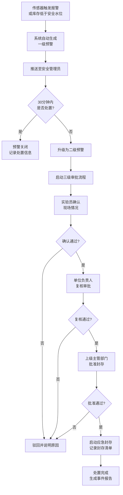
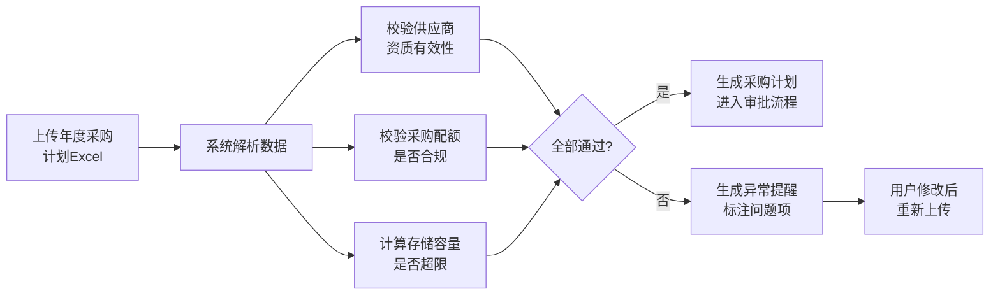

## 1. 产品概述

全国性实验室危险化学品安全监测与应急调度分析平台，通过实时接入全国各实验室危化品数据，实现全生命周期安全管控，包含库存监测、预警应急、采购管理、安全诊断等核心功能。

- **目标用户**：国家/省/单位三级安全管理人员、实验员、应急处置人员
- **核心价值**：降低危化品安全事故率，提升应急响应效率，优化采购库存管理

## 2. 核心功能

### 2.1 用户角色

| 角色 | 注册方式 | 核心权限 |
|------|----------|----------|
| 国家级管理员 | 系统分配 | 全国数据看板、跨省调度、全国报告审批 |
| 省级管理员 | 系统分配 | 省内数据看板、省内审批、省级报告生成 |
| 单位管理员 | 系统分配 | 单位内实验室管理、预警处置、采购审批 |
| 实验员 | 单位注册 | 台账录入、预警确认、采购申请 |
| 应急处置人员 | 系统分配 | 应急封存审批、事件处置记录 |

### 2.2 功能模块

1. **核心看板页面**：全国热力图、风险排名、省份/单位切换、下钻分析
2. **实时监测页面**：库存监测、温湿度监控、泄露传感器状态、使用台账
3. **预警应急页面**：一级/二级预警列表、三级审批流程、应急封存管理
4. **库存采购页面**：库存周转率、采购计划上传、供应商资质校验、容量预警
5. **安全诊断页面**：周度报告生成、同比分析、优化建议、培训推荐
6. **权限管理页面**：三级权限分配、用户管理、操作审计

### 2.3 页面详情

| 页面名称 | 模块名称 | 功能描述 |
|----------|----------|----------|
| 核心看板 | 顶部导航栏 | 省份/单位切换器、时间范围选择、全局搜索、预警通知 |
| 核心看板 | 数据概览卡片 | 总库存量、在线实验室数、活跃预警数、平均风险评分 |
| 核心看板 | 全国热力图 | 按省份展示危化品库存密度，支持点击下钻 |
| 核心看板 | 风险排名榜 | 单位/实验室风险评分排名，点击跳转详情 |
| 核心看板 | 7天趋势图 | 库存变化、事件数量、使用量趋势折线图 |
| 核心看板 | 泄露事件时间线 | 最近泄露事件列表，含时间、地点、等级、处置状态 |
| 实时监测 | 实验室列表 | 按单位筛选的实验室状态列表 |
| 实时监测 | 库存详情 | 化学品分类库存、低于安全水位标识、周转率计算 |
| 实时监测 | 传感器面板 | 温湿度实时数据、泄露传感器状态告警 |
| 实时监测 | 使用台账 | 取用记录、双锁执行记录、执行人信息 |
| 预警应急 | 预警列表 | 一级/二级预警筛选，含升级倒计时、处置状态 |
| 预警应急 | 预警详情 | 预警信息、实验室信息、处置记录时间线 |
| 预警应急 | 三级审批流 | 实验员确认→单位负责人复核→主管部门批准 |
| 预警应急 | 应急封存 | 封存启动、化学品清单、解封申请 |
| 库存采购 | 库存管理 | 分类统计、安全水位设置、周转率排名 |
| 库存采购 | 采购计划 | Excel上传、模板下载、导入预览 |
| 库存采购 | 供应商校验 | 资质自动校验、配额检查、异常提醒 |
| 库存采购 | 容量预警 | 超出容量20%自动提醒、存储建议 |
| 安全诊断 | 周度报告 | 自动生成报告、库存周转率同比、事件类型分布 |
| 安全诊断 | 执行率排名 | 双锁执行率、预警处置及时率排名 |
| 安全诊断 | 优化建议 | 采购优化推荐、培训计划推荐 |
| 权限管理 | 用户列表 | 三级用户管理、角色分配、状态控制 |
| 权限管理 | 操作审计 | 关键操作日志、筛选查询、导出功能 |

## 3. 核心流程

### 3.1 预警升级与应急审批流程

安全管理员收到一级预警后需在30分钟内处置，超时自动升级为二级预警并启动三级审批流程。

### 3.2 采购计划校验流程

## 4. 用户界面设计

### 4.1 设计风格

- **主色调**：深海军蓝 `#0A2463`（专业、权威、安全）
- **辅助色**：警示橙 `#F76C5E`、安全绿 `#3CAEA3`、警戒红 `#E63946`、信息蓝 `#457B9D`
- **背景色**：深蓝灰渐变 + 微弱网格纹理，营造科技感和专业感
- **按钮风格**：微立体圆角按钮，悬停时轻微上浮 + 阴影加深
- **字体**：使用思源黑体（Source Han Sans CN）作为主字体，搭配等宽字体展示数据
- **布局风格**：卡片式模块化布局，顶部导航 + 侧边筛选 + 主内容区
- **图标风格**：使用 Lucide 线性图标，关键状态配合彩色指示器
- **动效设计**：数据加载时骨架屏 + 渐显，预警卡片脉冲动画，热力图悬浮高亮

### 4.2 页面设计概览

| 页面名称 | 模块名称 | UI元素设计 |
|----------|----------|------------|
| 核心看板 | 数据概览卡片 | 玻璃拟态卡片 + 渐变背景色，数值大号粗体，趋势箭头微动画 |
| 核心看板 | 全国热力图 | 交互式中国地图，省份色块按库存密度渐变，悬浮显示详情卡片 |
| 核心看板 | 风险排名榜 | 横向进度条排名，前三名特殊高亮，风险评分彩色标签 |
| 核心看板 | 趋势图表 | 双Y轴折线图，多系列叠加，数据点悬浮提示框 |
| 核心看板 | 事件时间线 | 左侧时间轴 + 右侧事件卡片，不同等级用不同色彩竖线标识 |
| 预警应急 | 预警列表 | 表格 + 卡片混合，一级预警橙色边框，二级预警红色 + 脉冲动画 |
| 预警应急 | 审批流程 | 步骤条可视化，当前步骤高亮，已完成步骤绿色打勾 |
| 库存采购 | 上传组件 | 拖拽上传区 + 文件图标，解析进度条，异常行红底标注 |
| 安全诊断 | 报告页面 | 左右分栏布局，左侧目录导航，右侧报告正文含图表和数据卡片 |

### 4.3 响应式设计

- **设计优先**：Desktop-first（1920×1080为基准设计稿）
- **平板适配**（≥1024px）：侧边栏折叠为图标模式，热力图缩小但保持交互
- **移动适配**（≥768px）：顶部导航折叠为汉堡菜单，卡片单列排列，图表简化展示
- **触控优化**：移动端按钮最小44px触控区域，图表支持双指缩放

### 4.4 数据可视化特殊指导

- **中国热力图**：使用 GeoJSON 绘制省份轮廓，颜色阈值分5档（<20%浅蓝→>80%深红）
- **风险仪表盘**：半圆仪表盘，指针随评分从绿到红平滑过渡
- **库存玫瑰图**：分类化学品占比使用南丁格尔玫瑰图，类目名称外层环绕
- **审批流程图**：SVG 连接线 + 节点卡片，连接线在步骤通过时变为绿色流动动画
