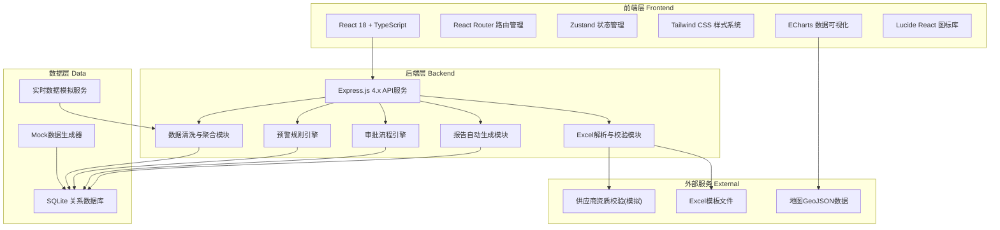
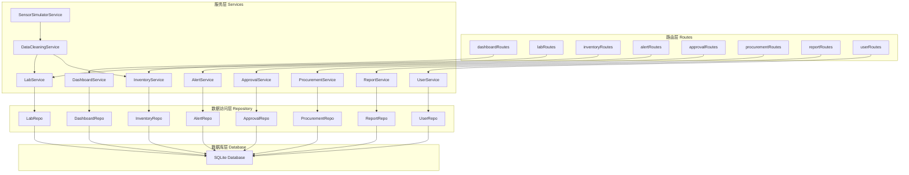
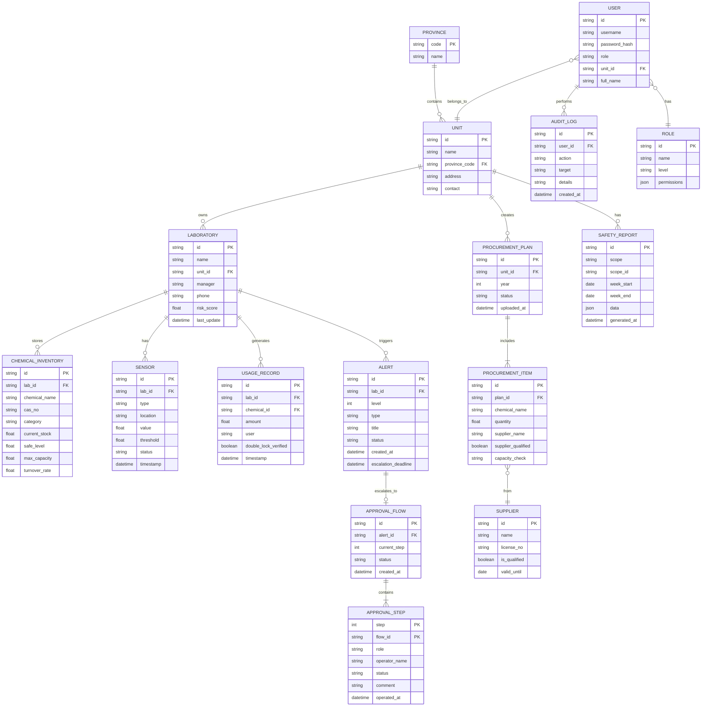

## 1. 架构设计



## 2. 技术描述

- **前端框架**：React 18 + TypeScript + Vite
- **后端框架**：Express 4 + TypeScript（ESM模式）
- **数据库**：SQLite（文件型，无需安装，便于演示）
- **状态管理**：Zustand（轻量级，支持持久化）
- **路由管理**：React Router DOM 6.x
- **样式方案**：Tailwind CSS 3.x + CSS变量主题系统
- **图表可视化**：ECharts 5.x（热力图、折线图、玫瑰图、仪表盘）
- **UI组件**：自研组件库（基于Tailwind）+ Radix UI（弹窗、下拉等无障碍组件）
- **图标库**：Lucide React
- **Excel处理**：SheetJS (xlsx)
- **初始化工具**：vite-init（react-express-ts模板）

## 3. 路由定义

| 路由路径 | 页面组件 | 功能说明 |
|----------|----------|----------|
| `/` | `Dashboard` | 核心看板（默认首页） |
| `/dashboard` | `Dashboard` | 核心看板，全国数据总览 |
| `/monitoring` | `Monitoring` | 实时监测，库存/传感器/台账 |
| `/monitoring/lab/:id` | `LabDetail` | 实验室详情下钻页面 |
| `/alerts` | `AlertList` | 预警列表，一二级预警管理 |
| `/alerts/:id` | `AlertDetail` | 预警详情与处置页面 |
| `/approvals` | `ApprovalList` | 三级审批流程列表 |
| `/approvals/:id` | `ApprovalDetail` | 审批流程详情与操作 |
| `/inventory` | `Inventory` | 库存管理与周转率分析 |
| `/procurement` | `Procurement` | 采购计划上传与校验 |
| `/diagnosis` | `Diagnosis` | 安全诊断周度报告 |
| `/diagnosis/:id` | `ReportDetail` | 历史报告详情查看 |
| `/permissions` | `Permissions` | 权限与用户管理（仅管理员） |
| `/login` | `Login` | 登录与角色选择页面 |

## 4. API 接口定义

### 4.1 通用响应结构

```typescript
interface ApiResponse<T> {
  code: number;
  message: string;
  data: T;
  timestamp: number;
}

interface PaginatedResponse<T> {
  items: T[];
  total: number;
  page: number;
  pageSize: number;
}
```

### 4.2 核心数据类型

```typescript
// 行政层级
type AdminLevel = 'national' | 'province' | 'unit';

// 风险等级
type RiskLevel = 'low' | 'medium' | 'high' | 'critical';

// 预警等级
type AlertLevel = 1 | 2;

// 预警状态
type AlertStatus = 'pending' | 'processing' | 'resolved' | 'escalated';

// 审批节点状态
type ApprovalStatus = 'pending' | 'approved' | 'rejected';

// 实验室信息
interface Laboratory {
  id: string;
  name: string;
  unitId: string;
  unitName: string;
  province: string;
  city: string;
  address: string;
  manager: string;
  phone: string;
  sensorCount: number;
  onlineSensors: number;
  riskScore: number;
  riskLevel: RiskLevel;
  lastUpdate: string;
}

// 化学品库存
interface ChemicalInventory {
  id: string;
  labId: string;
  chemicalName: string;
  casNo: string;
  category: string;
  hazardLevel: RiskLevel;
  currentStock: number;
  unit: string;
  safeLevel: number;
  maxCapacity: number;
  turnoverRate: number;
  lastRestock: string;
  supplierId: string;
}

// 传感器数据
interface SensorData {
  id: string;
  labId: string;
  type: 'temperature' | 'humidity' | 'leak';
  location: string;
  value: number;
  unit: string;
  threshold: number;
  status: 'normal' | 'warning' | 'alarm';
  timestamp: string;
}

// 使用台账
interface UsageRecord {
  id: string;
  labId: string;
  chemicalId: string;
  chemicalName: string;
  amount: number;
  user: string;
  doubleLockVerified: boolean;
  lockOperator1?: string;
  lockOperator2?: string;
  purpose: string;
  timestamp: string;
}

// 预警信息
interface Alert {
  id: string;
  labId: string;
  labName: string;
  unitName: string;
  province: string;
  level: AlertLevel;
  type: 'low_stock' | 'leak' | 'temperature' | 'humidity';
  title: string;
  description: string;
  relatedChemicalId?: string;
  relatedSensorId?: string;
  status: AlertStatus;
  createdAt: string;
  escalatedAt?: string;
  resolvedAt?: string;
  resolvedBy?: string;
  resolutionNote?: string;
  escalationDeadline: string;
}

// 审批流程
interface ApprovalFlow {
  id: string;
  alertId: string;
  alertInfo: Alert;
  currentStep: 1 | 2 | 3;
  status: ApprovalStatus;
  steps: ApprovalStep[];
  createdAt: string;
  completedAt?: string;
  sealedChemicalIds?: string[];
}

interface ApprovalStep {
  step: 1 | 2 | 3;
  role: string;
  operatorId?: string;
  operatorName?: string;
  status: ApprovalStatus;
  comment?: string;
  operatedAt?: string;
}

// 采购计划
interface ProcurementPlan {
  id: string;
  unitId: string;
  unitName: string;
  year: number;
  items: ProcurementItem[];
  uploadedBy: string;
  uploadedAt: string;
  status: 'pending' | 'approved' | 'rejected' | 'has_issues';
  issues: ProcurementIssue[];
}

interface ProcurementItem {
  id: string;
  chemicalName: string;
  casNo: string;
  quantity: number;
  unit: string;
  supplierName: string;
  supplierId: string;
  unitPrice: number;
  totalPrice: number;
  expectedDate: string;
  supplierQualified?: boolean;
  quotaCheck?: 'pass' | 'warn' | 'fail';
  capacityCheck?: 'pass' | 'warn' | 'fail';
}

interface ProcurementIssue {
  itemId: string;
  type: 'supplier' | 'quota' | 'capacity';
  severity: 'error' | 'warning';
  message: string;
}

// 安全诊断报告
interface SafetyReport {
  id: string;
  scope: AdminLevel;
  scopeId: string;
  scopeName: string;
  weekStart: string;
  weekEnd: string;
  generatedAt: string;
  data: ReportData;
}

interface ReportData {
  totalInventory: number;
  inventoryYoY: number;
  turnoverRate: number;
  turnoverRateYoY: number;
  totalEvents: number;
  eventsByType: Record<string, number>;
  avgRiskScore: number;
  doubleLockRate: number;
  doubleLockRanking: { unitName: string; rate: number }[];
  alertsResolvedInTime: number;
  alertsTimelyRate: number;
  recommendations: {
    procurement: string[];
    training: string[];
  };
}
```

### 4.3 接口列表

| 方法 | 路径 | 功能 | 请求参数 | 返回数据 |
|------|------|------|----------|----------|
| GET | `/api/dashboard/overview` | 获取看板概览数据 | `province?: string, unitId?: string` | `{ totalInventory, onlineLabs, activeAlerts, avgRiskScore }` |
| GET | `/api/dashboard/heatmap` | 获取全国热力图数据 | `province?: string` | `{ province: string, value: number, riskLevel }[]` |
| GET | `/api/dashboard/risk-ranking` | 获取风险排名 | `limit?: number, province?: string` | `{ unitId, unitName, score, level, trend }[]` |
| GET | `/api/dashboard/trends` | 获取7天趋势数据 | `unitId?: string, labId?: string` | `{ dates: string[], inventory: number[], events: number[], usage: number[] }` |
| GET | `/api/dashboard/events-timeline` | 获取泄露事件时间线 | `limit?: number, province?: string` | `EventTimelineItem[]` |
| GET | `/api/labs` | 获取实验室列表 | `province?, unitId?, page?, pageSize?` | `PaginatedResponse<Laboratory>` |
| GET | `/api/labs/:id` | 获取实验室详情 | - | `Laboratory & { inventory, sensors, records }` |
| GET | `/api/inventory` | 获取库存列表 | `labId?, category?, page?, pageSize?` | `PaginatedResponse<ChemicalInventory>` |
| GET | `/api/inventory/turnover` | 周转率分析 | `unitId?, days?: number` | `{ labId, labName, rate, ranking }[]` |
| GET | `/api/sensors` | 获取传感器数据 | `labId?, type?` | `SensorData[]` |
| GET | `/api/usage-records` | 获取使用台账 | `labId?, days?, page?, pageSize?` | `PaginatedResponse<UsageRecord>` |
| GET | `/api/alerts` | 获取预警列表 | `level?, status?, province?, page?, pageSize?` | `PaginatedResponse<Alert>` |
| GET | `/api/alerts/:id` | 获取预警详情 | - | `Alert & { approvalFlow? }` |
| POST | `/api/alerts/:id/resolve` | 处置预警 | `{ operatorId, note }` | `ApiResponse<Alert>` |
| GET | `/api/approvals` | 获取审批列表 | `status?, currentStep?, page?, pageSize?` | `PaginatedResponse<ApprovalFlow>` |
| POST | `/api/approvals/:id/operate` | 审批操作 | `{ step, operatorId, status, comment }` | `ApiResponse<ApprovalFlow>` |
| POST | `/api/procurement/upload` | 上传采购计划Excel | `multipart/form-data` | `ApiResponse<ProcurementPlan>` |
| GET | `/api/procurement/template` | 下载采购计划模板 | - | `Buffer (Excel文件)` |
| GET | `/api/procurement` | 获取采购计划列表 | `unitId?, year?, status?` | `ProcurementPlan[]` |
| GET | `/api/reports` | 获取安全诊断报告列表 | `scope?, scopeId?, page?, pageSize?` | `PaginatedResponse<SafetyReport>` |
| GET | `/api/reports/:id` | 获取报告详情 | - | `SafetyReport` |
| POST | `/api/reports/generate` | 手动生成报告 | `{ scope, scopeId, weekStart, weekEnd }` | `ApiResponse<SafetyReport>` |
| POST | `/api/auth/login` | 用户登录 | `{ username, password, role }` | `{ token, userInfo }` |
| GET | `/api/users` | 获取用户列表 | `role?, unitId?, page?, pageSize?` | `PaginatedResponse<User>` |
| GET | `/api/audit-logs` | 获取操作审计日志 | `userId?, action?, startTime?, endTime?` | `PaginatedResponse<AuditLog>` |

## 5. 后端服务架构图



## 6. 数据模型

### 6.1 ER 关系图



### 6.2 数据库初始化 (SQLite DDL)

```sql
-- 省份表
CREATE TABLE IF NOT EXISTS provinces (
  code TEXT PRIMARY KEY,
  name TEXT NOT NULL
);

-- 单位表
CREATE TABLE IF NOT EXISTS units (
  id TEXT PRIMARY KEY,
  name TEXT NOT NULL,
  province_code TEXT NOT NULL REFERENCES provinces(code),
  address TEXT,
  contact TEXT,
  created_at DATETIME DEFAULT CURRENT_TIMESTAMP
);

-- 实验室表
CREATE TABLE IF NOT EXISTS laboratories (
  id TEXT PRIMARY KEY,
  name TEXT NOT NULL,
  unit_id TEXT NOT NULL REFERENCES units(id),
  manager TEXT,
  phone TEXT,
  risk_score REAL DEFAULT 0,
  sensor_count INTEGER DEFAULT 0,
  online_sensors INTEGER DEFAULT 0,
  last_update DATETIME DEFAULT CURRENT_TIMESTAMP
);
CREATE INDEX IF NOT EXISTS idx_labs_unit ON laboratories(unit_id);

-- 化学品库存表
CREATE TABLE IF NOT EXISTS chemical_inventory (
  id TEXT PRIMARY KEY,
  lab_id TEXT NOT NULL REFERENCES laboratories(id),
  chemical_name TEXT NOT NULL,
  cas_no TEXT,
  category TEXT,
  hazard_level TEXT DEFAULT 'medium',
  current_stock REAL NOT NULL DEFAULT 0,
  unit TEXT DEFAULT 'kg',
  safe_level REAL NOT NULL DEFAULT 0,
  max_capacity REAL NOT NULL DEFAULT 0,
  turnover_rate REAL DEFAULT 0,
  last_restock DATETIME,
  supplier_id TEXT,
  updated_at DATETIME DEFAULT CURRENT_TIMESTAMP
);
CREATE INDEX IF NOT EXISTS idx_inv_lab ON chemical_inventory(lab_id);

-- 传感器数据表
CREATE TABLE IF NOT EXISTS sensors (
  id TEXT PRIMARY KEY,
  lab_id TEXT NOT NULL REFERENCES laboratories(id),
  type TEXT NOT NULL CHECK(type IN ('temperature','humidity','leak')),
  location TEXT,
  value REAL NOT NULL,
  unit TEXT,
  threshold REAL NOT NULL,
  status TEXT NOT NULL DEFAULT 'normal',
  timestamp DATETIME DEFAULT CURRENT_TIMESTAMP
);
CREATE INDEX IF NOT EXISTS idx_sensors_lab ON sensors(lab_id);

-- 使用台账表
CREATE TABLE IF NOT EXISTS usage_records (
  id TEXT PRIMARY KEY,
  lab_id TEXT NOT NULL REFERENCES laboratories(id),
  chemical_id TEXT REFERENCES chemical_inventory(id),
  chemical_name TEXT,
  amount REAL NOT NULL,
  user TEXT NOT NULL,
  double_lock_verified INTEGER NOT NULL DEFAULT 0,
  lock_operator1 TEXT,
  lock_operator2 TEXT,
  purpose TEXT,
  timestamp DATETIME DEFAULT CURRENT_TIMESTAMP
);
CREATE INDEX IF NOT EXISTS idx_usage_lab ON usage_records(lab_id);

-- 预警表
CREATE TABLE IF NOT EXISTS alerts (
  id TEXT PRIMARY KEY,
  lab_id TEXT NOT NULL REFERENCES laboratories(id),
  lab_name TEXT,
  unit_name TEXT,
  province TEXT,
  level INTEGER NOT NULL DEFAULT 1,
  type TEXT NOT NULL,
  title TEXT NOT NULL,
  description TEXT,
  related_chemical_id TEXT,
  related_sensor_id TEXT,
  status TEXT NOT NULL DEFAULT 'pending',
  created_at DATETIME DEFAULT CURRENT_TIMESTAMP,
  escalated_at DATETIME,
  resolved_at DATETIME,
  resolved_by TEXT,
  resolution_note TEXT,
  escalation_deadline DATETIME NOT NULL
);
CREATE INDEX IF NOT EXISTS idx_alerts_status ON alerts(status);
CREATE INDEX IF NOT EXISTS idx_alerts_lab ON alerts(lab_id);

-- 审批流程表
CREATE TABLE IF NOT EXISTS approval_flows (
  id TEXT PRIMARY KEY,
  alert_id TEXT NOT NULL REFERENCES alerts(id),
  current_step INTEGER NOT NULL DEFAULT 1,
  status TEXT NOT NULL DEFAULT 'pending',
  created_at DATETIME DEFAULT CURRENT_TIMESTAMP,
  completed_at DATETIME,
  sealed_chemical_ids TEXT
);

-- 审批步骤表
CREATE TABLE IF NOT EXISTS approval_steps (
  id TEXT PRIMARY KEY,
  flow_id TEXT NOT NULL REFERENCES approval_flows(id),
  step INTEGER NOT NULL,
  role TEXT NOT NULL,
  operator_id TEXT,
  operator_name TEXT,
  status TEXT NOT NULL DEFAULT 'pending',
  comment TEXT,
  operated_at DATETIME
);

-- 供应商表
CREATE TABLE IF NOT EXISTS suppliers (
  id TEXT PRIMARY KEY,
  name TEXT NOT NULL,
  license_no TEXT,
  is_qualified INTEGER NOT NULL DEFAULT 1,
  valid_until DATE,
  contact TEXT
);

-- 采购计划表
CREATE TABLE IF NOT EXISTS procurement_plans (
  id TEXT PRIMARY KEY,
  unit_id TEXT NOT NULL REFERENCES units(id),
  unit_name TEXT,
  year INTEGER NOT NULL,
  status TEXT NOT NULL DEFAULT 'pending',
  uploaded_by TEXT,
  uploaded_at DATETIME DEFAULT CURRENT_TIMESTAMP,
  issues TEXT
);

-- 采购项目表
CREATE TABLE IF NOT EXISTS procurement_items (
  id TEXT PRIMARY KEY,
  plan_id TEXT NOT NULL REFERENCES procurement_plans(id),
  chemical_name TEXT NOT NULL,
  cas_no TEXT,
  quantity REAL NOT NULL,
  unit TEXT,
  supplier_name TEXT,
  supplier_id TEXT,
  unit_price REAL,
  total_price REAL,
  expected_date DATE,
  supplier_qualified INTEGER,
  quota_check TEXT,
  capacity_check TEXT
);

-- 安全诊断报告表
CREATE TABLE IF NOT EXISTS safety_reports (
  id TEXT PRIMARY KEY,
  scope TEXT NOT NULL,
  scope_id TEXT NOT NULL,
  scope_name TEXT,
  week_start DATE NOT NULL,
  week_end DATE NOT NULL,
  data TEXT NOT NULL,
  generated_at DATETIME DEFAULT CURRENT_TIMESTAMP
);

-- 角色表
CREATE TABLE IF NOT EXISTS roles (
  id TEXT PRIMARY KEY,
  name TEXT NOT NULL,
  level TEXT NOT NULL,
  permissions TEXT
);

-- 用户表
CREATE TABLE IF NOT EXISTS users (
  id TEXT PRIMARY KEY,
  username TEXT NOT NULL UNIQUE,
  password_hash TEXT NOT NULL,
  full_name TEXT,
  role_id TEXT NOT NULL REFERENCES roles(id),
  unit_id TEXT REFERENCES units(id),
  phone TEXT,
  created_at DATETIME DEFAULT CURRENT_TIMESTAMP
);

-- 审计日志表
CREATE TABLE IF NOT EXISTS audit_logs (
  id TEXT PRIMARY KEY,
  user_id TEXT REFERENCES users(id),
  username TEXT,
  action TEXT NOT NULL,
  target TEXT,
  details TEXT,
  created_at DATETIME DEFAULT CURRENT_TIMESTAMP
);
CREATE INDEX IF NOT EXISTS idx_audit_user ON audit_logs(user_id);
```
